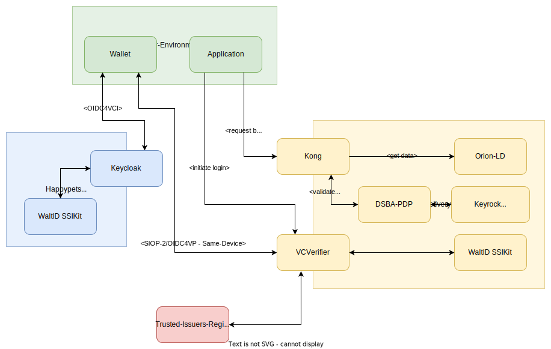

# VC-Integration Test

This repository contains a framework for writing Integration-Tests, integrating multiple components for 
authentication/authorization based on [VerifiableCredentials](https://www.w3.org/TR/vc-data-model/).

The components involved are:
* [Keycloak](https://www.keycloak.org/) with the [Keycloak-VC-Issuer](https://github.com/wistefan/keycloak-vc-issuer) to issue VerifiableCredentials 
* [VCVerifier](https://github.com/FIWARE/VCVerifier) to verify credentials and exchange them with [JWT](https://www.rfc-editor.org/rfc/rfc7519) via [SIOP-2](https://openid.net/specs/openid-connect-self-issued-v2-1_0.html#name-cross-device-self-issued-op)/[OIDC4VP](https://openid.net/specs/openid-4-verifiable-presentations-1_0.html#request_scope)
* [DSBA-PDP](https://github.com/FIWARE/dsba-pdp) acting as a Policy-Decision-Point(PDP) to make authorization decisions based on the JWT's
* [Kong](https://konghq.com/) with the [Kong-PEP-Plugin](https://github.com/FIWARE/kong-plugins-fiware/tree/main/kong-pep-plugin) acting as a Policy-Enforcement-Point(PEP), offering the APIs to the world and requesting decision for requests at the PDP.
* [Keyrock](https://github.com/ging/fiware-idm) as an [iShare](https://dev.ishare.eu/index.html) compliant AuthorizationRegistry, acting as the Policy-Administration-Point(PAP), providing the policies to the PDP.
* [WaltID SSIKit](https://github.com/walt-id/waltid-ssikit) as a downstream component, providing various functionalities around DIDs and VCs to Keycloak and VCVerifier
* [FIWARE iShare Satellite](https://github.com/FIWARE/ishare-satellite) to act as Trusted-Issuers-Registry(TIR) and iShare-TrustAnchor.
* [Orion-LD](https://github.com/FIWARE/context.Orion-LD) as [NGSI-LD](https://www.etsi.org/deliver/etsi_gs/CIM/001_099/009/01.06.01_60/gs_cim009v010601p.pdf) ContextBroker, to provide a backend-service.
* [iShare-JWT-Helper](https://github.com/wistefan/ishare-jwt-helper) as a convenience service for generating iShare-compliant tokens to be used with Keyrock.

## The setup



The test-setup effectivley compromises 3 environments:

- HappyPets in the role of a data-consumer, issuing credentials to its users
- PacketDelivery in the role of a data-provider, offering an application to access its data
- the User-Environment, which represents an (in this case machine-)user

The image depicts the general interaction between the components and participants. The sequence and concrete implementation of 
the interactions depend on the concrete scenarios. Please see the individual tests for more information. In general, the scenarios will 
follow the sequence:
1. Wallet and HappyPets interact in an OIDC4VCI flow, to get a credential into the wallet
2. The application and PacketDelivery interact to start a authentication flow
3. Wallet and PacketDelivery interact to authenticate with an actual credential
4. Application and PacketDelivery interact to make authorized requests, using the token provided from the previous step.

### HappyPets

HappyPets is company, offering a shop for animal products. It uses PacketDelivery' Services for deliverying the goods to its customers,
and there digital services to provide access to delivery-details. 
The HappyPets System uses [Keycloak](https://www.keycloak.org/) for Identiy Managment and issuing of credentials for its users. To participate
in the dataspace, HappyPets is registered with its decentralized identifier ```did:key:z6MkigCEnopwujz8Ten2dzq91nvMjqbKQYcifuZhqBsEkH7g``` at
the trusted-issuers-registry.

### PacketDelivery

PacketDelivery is an delivery service provider, that offers additional digial services to its customers. Depending on the
role, a user authorized by participants of the data space(like HappyPets) can access and manipulate delivery information like 
planned arrival times. 
To provide its services only to paying customers, a verifiable credentials based security framework is in places:
- Kong to verify and authorize JWT's in cooperation with the DSBA-PDP
- VCVerifier to offer a SIOP-2/OIDC4VP compliant login-flow

PacketDelivery uses an iShare compliant authorization registry to provide the policies required by the roles and trusts
HappyPets as an issuer in the dataspace.

### User Environment

The  [User Environment](./src/test/java/org/fiware/vc/it/model/UserEnvironment.java) in the test-setup is a somewhat theoretical
concept, representing the components usually installed and (directly) used by an end-user. We do not use real components
here, but implements the basic flows as part of a [World-Concept](https://github.com/cucumber/cucumber-js/blob/main/docs/support_files/world.md). 
The ```World``` typically provides an isolated scope, that is instantiated per scenario and shared between the individual steps.
In this implementation, we just model a part of the ```World```, the ```User Environment```. It contains the [Wallet](./src/test/java/org/fiware/vc/it/model/Wallet.java), 
which handles all flows typically executed by a wallet in [OIDC4VCI](https://openid.net/specs/openid-4-verifiable-credential-issuance-1_0.html) 
and [SIOP-2](https://openid.net/specs/openid-connect-self-issued-v2-1_0.html)/[OIDC4VP](https://openid.net/specs/openid-4-verifiable-presentations-1_0.html) flow.
Beside that, it also contains the [Application](./src/test/java/org/fiware/vc/it/model/Application.java). The ```Application```
could be a service implemented f.e. by HappyPets to interact with PacketDelivery through an M2M-interaction. It fullfills the responsibilities
of a requesting application in a "Same-Device-Flow", e.g. an interaction where the credential is present in the same machine/host as the acting application.

## Test

The tests use the [cucumber-framework](https://cucumber.io/) for defining the scenarios. 
Find them in the [test-resources](./src/test/resources/it) folder. To run the tests, use:

```shell
    mvn clean integration-test
```

## Local setup

In order to spin-up a local-environment, the maven-profile ```dev``` is provided. It's using the [kokuwaio/k3s-maven-plugin](https://github.com/kokuwaio/k3s-maven-plugin) to setup
a local k3s instance. 

To run it: 
```shell
    mvn clean integration-test -Pdev
```

The test-setup offers some endpoints at localhost: 

| Port | Participant    | Component                       |
|------|----------------|---------------------------------|
| 8080 | HappyPets      | Issuer                          |
| 7070 | PacketDelivery | Verifier                        |
| 8070 | PacketDelivery | PEP / Kong                      |
| 5080 | PacketDelivery | AuthorizationRegistry / Keyrock |
| 8060 |                | TokenHelper                     |

Identities of the participants can be found in there dedicated environment files:
- [Happypets](src/test/java/org/fiware/vc/it/HappyPetsEnvironment.java)
- [PacketDelivery](src/test/java/org/fiware/vc/it/PacketDeliveryEnvironment.java)